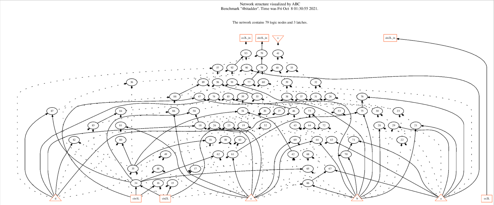

## Programming Assignment 1

### Submission Guidelines
Please send a pull request to the branch named with your student ID during the submission periods (see below).  
For Parts 1 and 2, please put the required items under `lsv_fall_2021/pa1`, i.e., this folder.  
For Part 3, please develop your code under `src/ext-lsv`.

#### Submission Periods
- Parts 1 and 2: 2021/10/08 11:00-13:00  
- Part 3: 2021/10/22 11:00-13:00 

### 1. [Using ABC]
(10%)  
(a) Use [BLIF manual](http://www.eecs.berkeley.edu/~alanmi/publications/other/blif.pdf) to create a BLIF file representing a four-number serial adder.  
(b) Perform the following steps to practice using ABC:
 1. read the BLIF file into ABC (command `read`)
 2. check statistics (command `print_stats`)
 3. visualize the network structure (command `show`)
 4. convert to AIG (command `strash`)
 5. visualize the AIG (command `show`)
 6. convert to BDD (command `collapse`)
 7. visualize the BDD (command `show_bdd -g`; note that `show_bdd` only shows the first PO; option `-g` can be applied to show all POs ) 


### 2. [ABC Boolean Function Representations]
(10%)  
In ABC there are different ways to represent Boolean functions.  
(a) Compare the following differences with the four-number serial adder example.  
1. logic network in AIG (by command `aig`) vs.
structurally hashed AIG (by command `strash`)
2. logic network in BDD (by command `bdd`) vs.
collapsed BDD (by command `collapse`)

(b) Given a structurally hashed AIG, find a sequence of ABC command(s) to covert it to a logic network with node function expressed in sum-of-products (SOP).

#### Items to turn in for Part 1 and 2:
 1. The BLIF file.
 2. A PDF report containing:
    - results of `show` and `show_bdd -g` after step 3,5,7 in Part 1
    - answers of question (a),(b) in Part 2. 

### 3. [Programming ABC]
(80%)  
Write a procedure in ABC that find maximum single-fanout cones (MSFCs) that covers all nodes (excluding PIs and POs) of a given AIG. 
Integrate this procedure into ABC, so that after reading in a circuit by the command `read`, running the command `lsv_print_msfc` would invoke your code.
 
The maximum single-fanout cone (MSFC) (c.f. [maximum fanout free cone (MFFC)](https://ieeexplore.ieee.org/document/1600459)
of node `v`, denoted `C(v)`, is the maximum set of nodes such that `u ∈ C(v)` if and only if 1) `u = v`, or 2) `|FO(u)| = 1` and `FO(u) ⊆ C(v)`.

For example, given an AIG in the following figure, 


we have the following decomposition:
```
MSFC 0: n8,n9,n10
MSFC 1: n11
MSFC 2: n12
MSFC 3: n13,n14,n15,n17,n18,n19,n20
MSFC 4: n16
MSFC 5: n21,n22,n23,n24
```

In each line of `MSFC i:`, print the names of nodes returned by function `Abc ObjName()`, and sort the nodes in an increasing order with respect to their object IDs returned by function `Abc ObjId()`. 
Lines of MSFCs are printed in an increasing order with respect to the smallest object ID of each MSFC. 
Make sure that only internal nodes (non-PI and non-PO nodes) are printed, and each node is printed only once.

