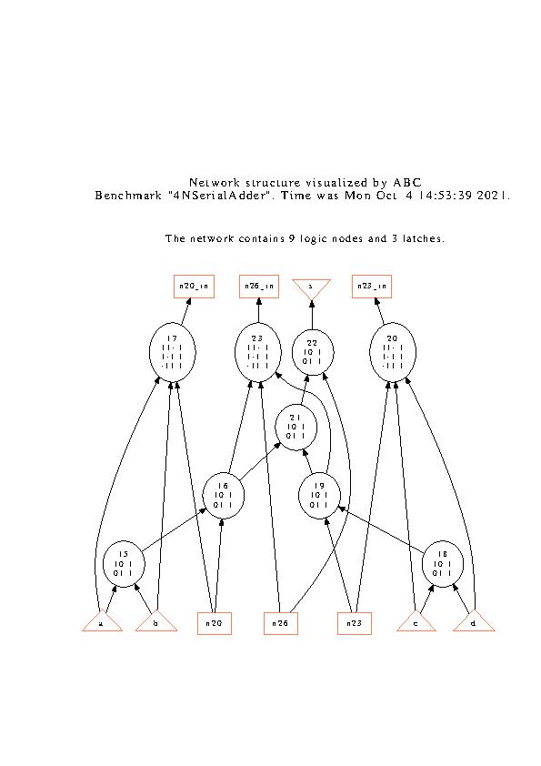
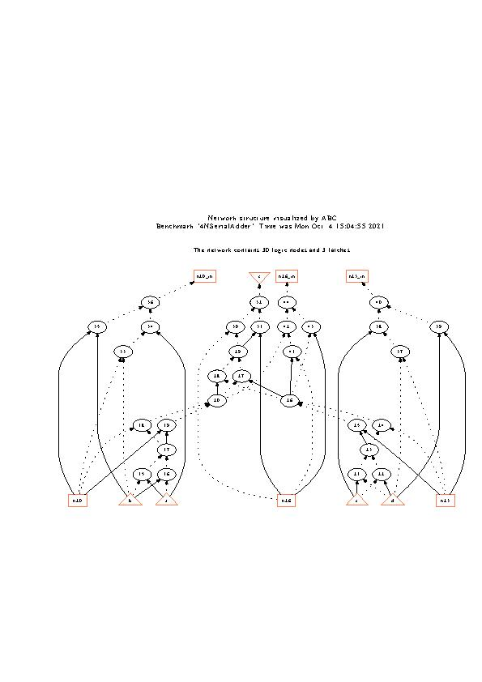
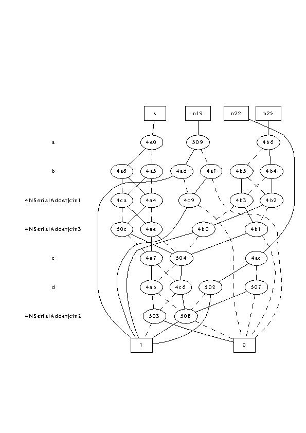

# Logic Synthesis & Verification, Fall 2021

Programming Assignment 1
Parts 1 and 2
Submit by r10943171 YanjenChen

## 1. [Using ABC]

### Step 3. visualize the network structure

### Step 5. visualize the AIG

### Step 7. visualize the BDD


## 2. [ABC Boolean Function Representations]

### (a). Compare the following differences with the four-number serial adder example.

#### 1. logic network in AIG (by command “aig”) vs. structurally hashed AIG (by command “strash” )

Apply following commands to the four-number serial adder example:
```
read 4_number_serial_adder.blif
print_stats
aig
print_stats
strash
print_stats
```

Can get the following outputs:
```
4NSerialAdder                 : i/o =    4/    1  lat =    3  nd =     9  edge =     21  cube =    21  lev = 4
4NSerialAdder                 : i/o =    4/    1  lat =    3  nd =     9  edge =     21  aig  =    30  lev = 4
4NSerialAdder                 : i/o =    4/    1  lat =    3  and =     30  lev =  8
```

We can observe that `aig` convert the reprentation of local node funciton into AIG format, while mantain the global network structure. `strash` rewrite the gloabl network into AIG format, the original structure is no longer exists. Also, if we use `show` command to print the network after these two commands, the result is differet.

#### 2. logic network in BDD (by command “bdd”) vs. collapsed BDD (by command “collapse”)

Apply following commands to the four-number serial adder example:
```
read 4_number_serial_adder.blif
print_stats
bdd
print_stats
collapse
print_stats
```

Can get the following outputs:
```
4NSerialAdder                 : i/o =    4/    1  lat =    3  nd =     9  edge =     21  cube =    21  lev = 4
4NSerialAdder                 : i/o =    4/    1  lat =    3  nd =     9  edge =     21  bdd  =    24  lev = 4
4NSerialAdder                 : i/o =    4/    1  lat =    3  nd =     4  edge =     20  bdd  =    25  lev = 1
```

Similar with the relations between `aig` and `strash`, `bdd` transform local node reprentation into BDD format, while mantain the global structure. `collapse` rewrite the global network. We can use `show_bdd -g` to visualize the differences.

### (b). Given a structurally hashed AIG, find a sequence of ABC commands to covert it to a logic network with node function expressed in sum-of-products (SOP).

According to the discription of `logic -h` command:
```
usage: logic [-h]
                transforms an AIG into a logic network with SOPs
        -h    : print the command usage
```

If we execute the following commands:
```
read 4_number_serial_adder.blif
strash
logic
show
```

We can get the result logic network, where each node function is the SOP of two input.

Here's another set of commands which can produce similiar result:
```
read 4_number_serial_adder.blif
strash
renode
sop
show
```
